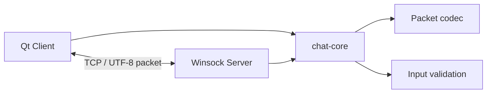

# chat-app

Windows 환경에서 동작하는 C++17 기반 멀티 클라이언트 TCP 채팅 애플리케이션입니다.  
서버는 Winsock2와 스레드를 사용하고, 클라이언트는 Qt Widgets와 Qt Network로 구현했습니다.

## 주요 기능

- 닉네임 기반 접속 및 중복 닉네임 검사
- 채팅방 생성, 입장, 퇴장 및 목록 조회
- 방별 채팅과 접속자 목록 갱신
- 사용자 간 귓속말
- 닉네임 변경
- 방 소유자의 사용자 강퇴 및 방 닫기
- 연결 종료와 비정상 패킷 처리
- 최대 10개 클라이언트 동시 접속

현재 사용자와 방 정보는 서버 메모리에서만 관리합니다. 서버를 종료하면 실행 중 생성된 상태는 초기화됩니다.

## 기술 스택

| 구분 | 기술 |
| --- | --- |
| Language | C++17 |
| Client | Qt 6 Widgets, Qt Network |
| Server | Winsock2, STL Thread |
| Build | Visual Studio 2022, MSBuild |
| Platform | Windows x64 |

## 구조



| 구성 요소 | 역할 |
| --- | --- |
| `chat-core` | 공통 메시지 타입, 패킷 인코딩·디코딩, 입력 검증 |
| `QtClient` | 서버 연결, 채팅 UI, 방·사용자·소유자 도구 제공 |
| `Server` | 클라이언트 세션, 방 상태, 명령 처리와 메시지 중계 |

## 패킷 규격

TCP 스트림 위에서 다음 형식의 패킷을 사용합니다.

```text
+--------------------+--------------------+-----------------------+
| type (4 bytes)     | size (4 bytes)     | UTF-8 payload         |
+--------------------+--------------------+-----------------------+
```

- `type`: `MESSAGE_TYPE` 값
- `size`: payload의 바이트 길이
- 정수 필드: Big Endian(Network Byte Order)
- 헤더 크기: 8바이트
- 최대 payload: 64 KiB

TCP는 메시지 경계를 보장하지 않으므로 클라이언트는 수신 버퍼를 유지하며 `COMPLETE`, `NEED_MORE_DATA`, `INVALID_PACKET` 상태로 패킷을 판별합니다.

## 명령어

| 명령 | 설명 |
| --- | --- |
| `/list` | 현재 방 사용자 목록 조회 |
| `/rooms` | 방 목록 조회 |
| `/create <room>` | 새 방 생성 후 입장 |
| `/join <room>` | 기존 방 입장 |
| `/leave` | 현재 방을 나가 Lobby로 이동 |
| `/name <nickname>` | 닉네임 변경 |
| `/w <nickname> <message>` | 귓속말 전송 |
| `/whisper <nickname> <message>` | 귓속말 전송 |
| `/kick <nickname>` | 방 소유자가 사용자를 Lobby로 이동 |
| `/close` | 방 소유자가 현재 방 닫기 |

## 프로젝트 구조

```text
chat-app/
├─ dev/
│  ├─ core/
│  │  └─ src/
│  │     ├─ include/       # 공통 타입과 공개 인터페이스
│  │     ├─ packet_codec.cpp
│  │     └─ validation.cpp
│  ├─ client/
│  │  ├─ form/             # Qt Designer UI
│  │  └─ src/              # Qt 클라이언트
│  └─ server/
│     └─ src/              # Winsock 서버
├─ project/
│  ├─ chat-core/
│  ├─ QtClient/
│  └─ Server/
└─ chat-app.sln
```

## 빌드 환경

다음 환경을 기준으로 구성했습니다.

- Visual Studio 2022
- Desktop development with C++ 워크로드
- Qt 6.8.1 `msvc2022_64`
- Windows x64

Qt 경로는 현재 `C:\Qt\6.8.1\msvc2022_64`로 설정되어 있습니다. 설치 경로가 다르면 `project/QtClient/QtClient.vcxproj`의 `QtInstallDir` 값을 변경해야 합니다.

### Visual Studio

1. `chat-app.sln`을 엽니다.
2. 구성을 `Release`, 플랫폼을 `x64`로 선택합니다.
3. 솔루션을 빌드합니다.

### Developer Command Prompt

```powershell
msbuild chat-app.sln /t:Rebuild /p:Configuration=Release /p:Platform=x64
```

빌드 결과는 `binary/`에 생성됩니다. Qt 클라이언트 실행에 필요한 DLL과 `platforms/qwindows.dll`도 빌드 후 복사됩니다.

## 실행

서버를 먼저 실행한 다음 클라이언트를 실행합니다.

```powershell
.\binary\Server.exe
.\binary\QtClient.exe
```

기본 연결 정보는 다음과 같습니다.

```text
Host: 127.0.0.1
Port: 9000
```

여러 클라이언트의 동작을 확인하려면 `QtClient.exe`를 두 개 이상 실행하고 서로 다른 닉네임으로 접속합니다.

## 현재 범위와 제한사항

- Windows Winsock2 기반이므로 서버는 Windows 전용입니다.
- 계정, 데이터베이스 및 채팅 기록 영구 저장 기능은 포함하지 않습니다.
- TLS 암호화와 파일 전송 기능은 포함하지 않습니다.
- `binary/`, Visual Studio 캐시와 중간 빌드 결과는 Git에서 제외합니다.

